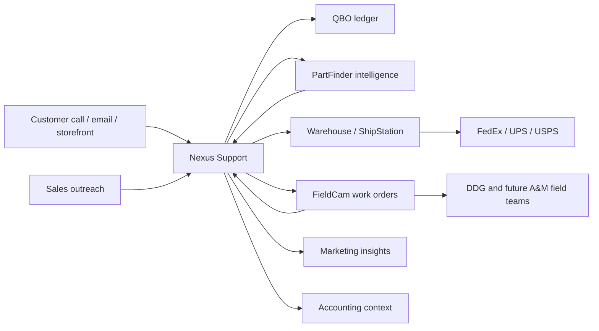

# Platform Architecture

## Purpose

Automatics & More is growing from a parts, support, and shipping operation into a coordinated service, install, and field execution operation. The architecture must support customer service, technical support, sales, purchasing, warehouse, accounting, marketing, and deployed field teams without forcing every department into the same screen.

## System Roles

| System | Permanent role | Should own | Should not own |
|---|---|---|---|
| Nexus Support | Internal operations brain | Inbox, phone calls, tickets, tech cases, quotes, POs, vendor decisions, shipping coordination, accounting context, sales and marketing operating views | Field job execution UI, raw mobile photo capture, field-only workflow |
| FieldCam | Field operations home | Jobsites, assigned work, field photos/videos, forms, measurements, site notes, field status, outside sales/partner quoting | Internal vendor credential sprawl, ShipStation/QBO write flows, office inbox ownership |
| PartFinder | Part intelligence | Canonical parts, part numbers, cross-references, price sheets, vendor offers, availability confidence | Customer conversations, accounting ledger, field job lifecycle |
| QBO | Financial source of truth | Customers, items, estimates, POs, invoices, bills, financial reporting | Bin-level warehouse reality, photo inventory, vendor web scraping |
| Sortly | Physical inventory layer | Local inventory photos, labels, bin/location state, counts during transition | Financial value source of truth |
| ShipStation | Shipping execution | Labels, carrier rates, shipment status, tracking | Sales pipeline, quote approval, vendor ordering |
| Volusion | Storefront | Public product/customer ordering path | Internal workflow |

## High-Level Flow

## Operating Principle

Each app gets a clear permanent home. Integration happens through channels, not by copying every screen into every app.

- Nexus exposes curated operational channels to FieldCam.
- FieldCam sends field events back to Nexus.
- PartFinder exposes normalized part intelligence to both.
- QBO and ShipStation writes stay behind internal workflows unless explicitly approved.

## Department Views

| Department | Primary app | Needs to see |
|---|---|---|
| Customer Service | Nexus | customer history, quote state, PO state, tech cases, order handoff |
| Sales | Nexus first, FieldCam remote later | selling trends, quote pressure, customer POs, vendor price and availability, comparables |
| Technical Support | Nexus | live/recent calls, transcripts, docs, procedures, parts, case notes |
| Warehouse/Shipping | Nexus | ShipStation queue, watchdog regressions, vendor/drop ship coordination, tracking |
| Accounting | Nexus/QBO | quote/PO/invoice links, margin, exceptions, unmatched customer POs |
| Marketing | Nexus first, FieldCam/remote summaries later | product demand, search demand, lead quality, catalog gaps, campaign outcomes |
| Field Teams | FieldCam | assigned jobs, jobsite docs, photos, forms, measurements, status, field notes |

## Data Strategy

Use normalized entities instead of department-specific copies:

- Customer and account
- Contact and phone/email identity
- Ticket/support case
- Quote/estimate
- Customer PO
- Vendor PO
- Shipment
- Jobsite/work order
- Canonical part
- Part identifier
- Vendor offer
- Inventory location
- Tech document
- Field event

## Security Boundary

Nexus is LAN/internal-first and may contain broad operational context. FieldCam is outside-facing and mobile/desktop. FieldCam should receive filtered data:

- allowed jobsites
- assigned field work
- approved customer-facing quote information
- safe part intelligence
- selected tech documents
- remote dashboards that do not expose secrets or full internal inbox data

## Build Sequence

1. Finish internal Nexus dashboards and workflow cleanup.
2. Define the Nexus to FieldCam remote channel.
3. Normalize PartFinder data.
4. Add FieldCam integration panels that consume curated channels.
5. Add automation and AI assistance only after the data contracts are stable.

## System Of Record Boundaries

| Domain | Source of truth | Suite behavior |
|---|---|---|
| Customer/account operating view | Nexus | Consolidates contacts, cases, quotes, orders, field work, calls, and external references. |
| Accounting, invoices, payments | QBO | Nexus initiates or mirrors approved accounting actions, but QBO remains the ledger. |
| Physical inventory | Sortly during transition | Nexus and PartFinder consume balances and item references; future ownership can be revisited. |
| Shipment execution | ShipStation | Nexus requests and tracks shipments; ShipStation owns labels, carriers, and tracking state. |
| Field visits and evidence | FieldCam | FieldCam owns visit execution, photos, forms, measurements, and completion packets. |
| Part identity and vendor offers | PartFinder | PartFinder owns canonical part intelligence, source provenance, and offer confidence. |
| Phone/call system | Office@Hand | Nexus links calls and transcripts to support interactions and customer timelines. |
| Public storefront | Volusion | Nexus consumes demand and order signals; storefront remains the public shopping path. |

## Shared Architecture Principles

- Keep each app focused on the job it owns.
- Integrate through explicit channels instead of copying every screen into every app.
- Store external IDs as references, not as primary internal IDs.
- Preserve source provenance for every call, quote, PO, shipment, inventory balance, field event, vendor offer, price, and availability claim.
- Model DDG as the current field partner/team, not as a hard-coded product assumption.
- Make future Automatics & More field teams a configuration and permissions change, not a rebuild.
- Allow manual imports and links early, but put them behind contracts that can later become APIs.

## Canonical Entity Ownership

Nexus should own:

- `customer_id`
- `site_id`
- `contact_id`
- `ticket_id` or `case_id`
- `quote_id`
- `customer_purchase_order_id`
- `vendor_purchase_order_id`
- `shipment_request_id`
- `work_order_id`
- `support_interaction_id`

FieldCam should own:

- `field_visit_id`
- `field_event_id`
- `media_asset_id`
- `field_form_response_id`
- `field_part_request_id`
- `partner_lead_id`

PartFinder should own:

- `canonical_part_id`
- `part_identifier_id`
- `cross_reference_id`
- `vendor_id`
- `vendor_offer_id`
- `price_sheet_id`
- `availability_snapshot_id`
- `sourcing_request_id`

## Integration Styles

Use three interaction styles:

- Query APIs for lookup: part search, field work snapshot, customer timeline, quote detail.
- Commands for requested changes: dispatch work, request shipment, create QBO estimate, create sourcing request.
- Events for facts that happened: call completed, field visit completed, media uploaded, quote approved, vendor offer changed, shipment delivered.

All integration messages need correlation IDs, idempotency keys, actor context, source, target, timestamp, schema version, and external references when available.

## Suite Roadmap

Phase 0: Canonical docs and contracts

- Adopt this PRD packet as the source of truth.
- Inventory old PRDs and reduce them to pointers.
- Confirm shared entity names, IDs, and channel ownership.

Phase 1: Nexus workflow cleanup

- Tighten sales, customer service, technical support, quote, PO, and shipping dashboards.
- Create canonical `SupportInteraction` and customer timeline concepts.
- Stabilize Office@Hand, QBO, ShipStation, Sortly, and PartFinder handoffs.

Phase 2: PartFinder normalization

- Move from flat catalog rows to canonical parts, identifiers, cross-references, vendor offers, price confidence, and availability state.
- Expose stable PartFinder APIs for Nexus and FieldCam.
- Add vendor price sheet import and review.

Phase 3: FieldCam remote channel

- Publish curated Nexus work to FieldCam.
- Send field status, photos, forms, part requests, and completion packets back to Nexus.
- Add company/team-aware visibility for DDG, outside sales partners, and future A&M field teams.

Phase 4: Automation and intelligence

- Add AI assistance only where source data, audit trail, and acceptance controls exist.
- Add vendor reliability, quote conversion, field quality, and marketing attribution reporting.
- Automate repetitive handoffs after manual workflows have proven stable.

## Open Decisions

- Should Nexus own customer records and sync to QBO, or should QBO seed customer records into Nexus?
- Which QBO objects should Nexus create first: estimates, invoices, items, purchase orders, or bills?
- Should Sortly remain the long-term physical inventory system?
- Which vendors can provide approved feeds, account-backed exports, or price sheets?
- What field media retention policy is required for customer disputes, warranty, and training?
- Which identity provider will support staff, DDG, outside sales partners, and future A&M field users?
- What internal cost, margin, call, and customer-history data may be exposed to remote users?
