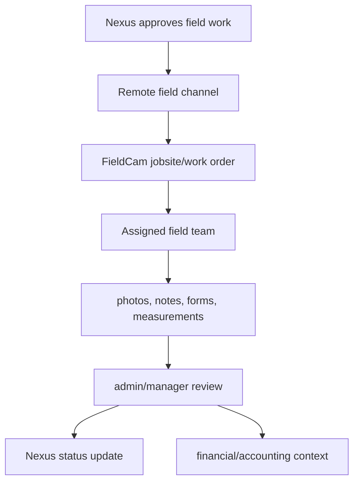

# FieldCam PRD

## Product Role

FieldCam is the permanent field operations home. It is not a temporary Nexus window. It exists for deployed service techs, install teams, outside sales partners, and future Automatics & More field teams.

DDG currently acts as the quasi field team. As Automatics & More grows into installs and field service, FieldCam becomes the field execution app that can support both DDG and A&M without mixing their internal business systems directly.

## Primary Users

- DDG field technicians
- DDG admins coordinating jobs
- outside sales partners
- future A&M field technicians/installers
- future A&M field managers
- accounting/admin users who review completed work

## Current Shape

FieldCam is already jobsite-centric:

- assigned jobsites
- job details
- photos and videos
- notes
- forms
- estimates/proposals
- review queue
- customer hierarchy
- partner/outside sales dashboards
- mobile and desktop layout
- Firestore offline persistence
- video call support

## Permanent Field Workflow

## What FieldCam Should Own

- jobsite/work order execution
- site contacts and field-safe customer context
- photos, videos, measurements, forms
- arrival and status updates
- field notes and material findings
- technician collaboration
- field quote capture where appropriate
- outside sales partner quoting and book-of-business views

## What FieldCam Should Not Own

- full internal Nexus inbox
- raw Office@Hand call logs for all departments
- QBO token or ledger writes
- ShipStation label creation
- broad vendor credential access
- unfiltered marketing/customer lists

## Sales and Marketing in FieldCam

FieldCam can have sales and marketing surfaces, but they should be remote team surfaces, not office-system clones.

Good fits:

- outside sales partner dashboards
- field lead capture
- site opportunity notes
- customer reorder or service opportunities
- approved quote/proposal status
- product/customer insights published from Nexus
- lightweight marketing campaign readouts for remote users

Bad fits:

- internal-only margin dashboards
- full QBO reports
- raw Hibu imports
- internal vendor comparison with confidential cost details

## Future A&M Field Team Support

FieldCam should be company/team-aware:

- `companyId`: `ddg`, `automatics-and-more`, partner slug, or future entity
- `teamId`: install, service, survey, outside sales
- `jobOwner`: who owns the customer relationship
- `sourceSystem`: Nexus, FieldCam, partner, manual
- role-based visibility by company/team

## Integration Points

FieldCam should consume from Nexus through a curated remote channel and send events back:

- incoming work orders
- approved scopes
- part requests
- field status updates
- photo/form/note summaries
- job completion packets

## Near-Term Build Priorities

1. Keep FieldCam's field dashboard clean and jobsite-first.
2. Add a Nexus integration admin panel under developer/admin tools.
3. Add `nexusEvents` or `integrationEvents` for inbound/outbound channel traffic.
4. Add mapping from approved Nexus field work to FieldCam jobsites.
5. Add field event publishing back to Nexus.
6. Add company/team-aware visibility before A&M field teams go live.

## Product Goals

- Give deployed service, install, survey, and outside sales users one reliable field home.
- Support DDG as the current quasi field team while keeping the model ready for future Automatics & More field teams.
- Capture trusted field evidence: photos, videos, measurements, forms, notes, parts, customer signoff, and status.
- Feed Nexus with structured events that can become tickets, quote updates, POs, customer follow-up, or sales opportunities.
- Feed PartFinder with field-originated part requests, photos, labels, measurements, and symptom clues.
- Work in low-connectivity environments without losing field data.

## Non-Goals

- FieldCam does not replace Nexus for internal tickets, quote approval, customer PO matching, purchasing, shipping, or accounting.
- FieldCam does not hold broad QBO, Office@Hand, ShipStation, Sortly, or vendor credentials.
- FieldCam does not expose internal margin, vendor cost, raw call logs, or unfiltered customer lists to outside partners.
- FieldCam does not directly order parts from vendors unless a later approved workflow adds that authority.

## Core Records

| Record | Purpose |
|---|---|
| `Jobsite` | Field-safe site record and local execution context. |
| `WorkOrder` | Nexus-approved work scope or FieldCam-originated assignment. |
| `FieldVisit` | Actual visit instance with status, timestamps, assignee, and completion state. |
| `FieldEvent` | Atomic event: arrived, note added, photo uploaded, form submitted, part request created, complete. |
| `MediaAsset` | Photo, video, document, signature, or supporting file with provenance. |
| `FieldFormResponse` | Structured checklist, measurement, or service/install form. |
| `FieldPartRequest` | Part identification, source, quote, inventory, or replacement need from the field. |
| `PartnerLead` | Outside sales or partner-originated opportunity. |

## Required Workflows

### Nexus-Assigned Field Work

1. Nexus publishes approved field work through the remote channel.
2. FieldCam maps the payload into a jobsite/work order after validation.
3. Assigned user accepts, rejects, or requests schedule change.
4. User checks in, captures required before evidence, performs work, records findings, and captures after evidence.
5. User records parts used, materials needed, measurements, customer signoff, and blocked items.
6. FieldCam sends a completion packet to Nexus.
7. Nexus routes follow-up to support, quotes, purchasing, warehouse, accounting, or sales.

### Field-Originated Part Request

1. User photographs the part, equipment plate, control board, operator, sensor, or site condition.
2. User records visible markings, manufacturer, symptoms, voltage/size, quantity, and urgency.
3. FieldCam creates a `FieldPartRequest`.
4. Nexus receives the request and may create a ticket, quote line, PO need, or customer follow-up.
5. PartFinder receives the request and returns likely matches, cross-references, offers, and confidence where allowed.

### Outside Sales Lead

1. Partner creates a lead with customer/site/contact, photos, notes, product/service need, and source attribution.
2. FieldCam validates required fields and partner scope.
3. Nexus receives a lead/opportunity event.
4. Nexus sales qualifies, converts, rejects, or requests more information.
5. Partner sees only safe status and next-step feedback.

### Offline Capture

1. FieldCam caches assigned work, forms, and safe context.
2. User records photos, notes, forms, measurements, status, and signatures offline.
3. Pending events store local timestamps, device/app metadata, and idempotency keys.
4. Sync resumes when connectivity returns.
5. Duplicate submission is prevented and conflicts are visible to admins.

## Functional Requirements

### Assignment Inbox

- Show assigned work by schedule, priority, distance, customer/site, or status.
- Support work types: service, install, inspection, survey, sales visit, pickup/dropoff, and follow-up.
- Display only customer/site/contact fields allowed for the user's company/team/role.
- Support accept, reject, en route, arrived, in progress, blocked, waiting on customer, waiting on parts, complete, incomplete, cancelled.

### Field Evidence

- Capture before, after, damage, equipment plate, part, measurement, obstruction, site overview, and supporting document categories.
- Preserve original media where policy requires it.
- Generate thumbnails and previews.
- Attach actor, timestamp, upload timestamp, jobsite, visit, category, and visibility scope.
- Use expiring access URLs for remote viewing.

### Forms And Measurements

- Support configurable forms by work type.
- Include typed measurements for dimensions, opening type, door type, operator type, voltage, handedness, swing/slide details, finish, mounting, safety issues, and accessibility constraints where relevant.
- Allow both structured fields and freeform notes.
- Prevent completion if required fields are missing.

### Partner And Company Visibility

- Support `companyId`, `teamId`, `jobOwner`, `sourceSystem`, and role-based visibility.
- DDG, A&M, and outside sales partners should use the same architecture with different scopes.
- Partner users see only assigned work, submitted leads, or explicitly shared summaries.
- Partner attribution must persist into Nexus quote, sales, and marketing reporting.

### Customer Signoff

- Capture signer name, signature, timestamp, summary shown, and refusal reason if declined.
- Link signoff to completion packet and media.
- Keep customer signoff simple and accountless unless a future customer portal exists.

## Integration Requirements

| Integration | FieldCam behavior |
|---|---|
| Nexus | Consumes approved work; emits status, media, forms, notes, part requests, lead events, and completion packets. |
| PartFinder | Sends part requests and receives technician-safe suggestions. |
| Sortly | Optionally queries truck/warehouse item availability if permitted. |
| Media storage | Stores original and derivative media with retention and access control. |
| Video/calls | Supports field collaboration without exposing broad Office@Hand internals. |

## MVP Acceptance Criteria

- A DDG user can receive and complete assigned work without seeing unrelated internal Nexus data.
- A future A&M field user can follow the same core flow under a different company/team scope.
- An outside sales partner can submit a scoped lead with photos and attribution.
- Required field photos, forms, parts, and signoff are enforced by work type.
- FieldCam can queue offline notes, forms, photos, and status changes and sync them later without duplicates.
- Nexus receives structured completion packets that can drive quotes, POs, tickets, sales follow-up, or accounting review.

## Success Metrics

- Visit completion rate.
- Required photo/form compliance.
- Field completion to Nexus action time.
- Part request resolution time.
- Offline sync failure rate.
- Revisit rate.
- Partner lead conversion rate.
- Customer signoff completion rate.

## Open Questions

- Which mobile OS versions and devices are required for launch?
- Is GPS required, optional, or prohibited by user role?
- What media retention period applies to service proof, warranty, and disputes?
- Which forms are required for service, install, inspection, survey, and outside sales?
- What DDG-specific process must be configuration in v1?
- What status should partners see after Nexus takes over a lead or quote?
